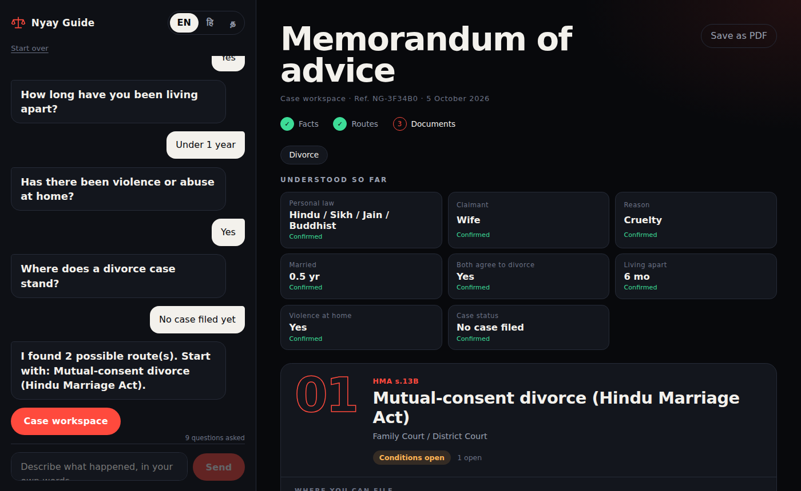

# Nyay Guide

**Which law, which court?** A rule-based dialogue agent that helps people in India work out which family-law remedies apply to them (divorce, maintenance, domestic-violence relief, dependants), where to file, and what to gather first. Available in English, Hindi and Tamil.

**Live:** https://nyay-guide.onrender.com (free tier, first load after idle takes about 30 seconds)



> **Decision support, not legal advice.** Every provision in the engine is written from the statutes and marked `verified: false`. It has not been reviewed by an advocate. Do not rely on it for a real case.

## What it does
You describe your situation in plain language. The agent reads it, asks only the questions whose answers would change the outcome, and builds a memorandum as you go.

- **Routes:** the applicable remedies, each with its provision, forum, venue options and authorities. Covers divorce, interim and permanent maintenance, maintenance of children and parents, the Domestic Violence Act and the Senior Citizens Act.
- **Personal laws:** Hindu (including Sikh, Jain, Buddhist), Muslim, Christian, Parsi and the Special Marriage Act.
- **Open conditions:** what still blocks a remedy, such as the one-year bar, the s.125(4) CrPC disqualifiers, or the separation period for mutual consent.
- **Sequence and documents:** a suggested order of filing with the documents to gather, plus the Rajnesh v. Neha disclosure checklist.
- **Live updates:** routes appear as soon as the law and your need are known, and update with each answer. Every question explains which routes it affects.
- **Languages:** the interface, questions and intake work in English, Hindi and Tamil. Remedy titles, plan steps and document lists are English only for now.
- **Print:** "Save as PDF" prints the memorandum on a white page.

## How it works
No generative LLM. The rules decide everything; a small encoder (about 120M parameters) can only *suggest* facts, and the person always confirms them.

| Layer | File | Role |
|---|---|---|
| Intake | `backend/app/india/intake.py` | Lexicon in en/hi/ta and romanised Hinglish with word boundaries, negation ("never beat me"), conflicts ("Hindu ... married a Christian") and durations. Returns confident facts, tentative suggestions and conflicts. |
| Small model | `backend/app/india/slm.py`, `exemplars.py` | Multilingual encoder (int8 multilingual-e5-small via ONNX, hashing fallback) matches the text to labelled example sentences. Suggestions only, with abstention margins. Add examples in `exemplars.py` to teach it new phrasings. |
| Groq (optional) | `backend/app/india/groq_assist.py` | Off by default. Used only when nothing else found anything; output is validated and is also a suggestion only. |
| Rule engine | `backend/app/india/engine.py` | Takes the personal law and facts, returns remedies, venues, open conditions and disclosures. |
| Agent | `backend/app/india/agent.py` | Picks the next question by information gain (the unknown fact that best splits the engine's outcomes), stops when no fact can change the result, builds the plan and checklists. |
| API | `backend/app/india_api.py` | FastAPI routes. |
| Frontend | `frontend/` | React and Vite. |

The same service serves the built React app and the API, so there is one URL and no CORS setup in production.

## API
| Method | Path | Purpose |
|---|---|---|
| `POST` | `/api/india/agent` | One dialogue turn. Body: `session_id`, `text`, `answer`, `lang` (`en`, `hi`, `ta`). |
| `POST` | `/api/india/advise` | Stateless: send all facts, get remedies. |
| `POST` | `/api/india/intake` | Extract facts from free text. |
| `GET` | `/api/india/catalogue` | All remedies the engine knows. |
| `GET` | `/api/health` | Health check. |

Sessions are held in memory (last 500) and are lost on restart. Nothing is written to disk.

## Run locally
Requires Python 3.12 and Node 20.

```bash
python3.12 -m venv .venv && source .venv/bin/activate
pip install -r backend/requirements.txt pytest httpx

cd backend && uvicorn app.main:app --reload --port 8000     # terminal 1
cd frontend && npm install && npm run dev                   # terminal 2, http://localhost:5173
```

## Test and evaluate
```bash
PYTHONPATH=backend pytest tests -q                  # 79 tests
PYTHONPATH=backend python -m research.intake_eval   # intake v1 vs v2 vs small model
PYTHONPATH=backend python -m research.india_eval    # engine vs baselines
PYTHONPATH=backend python -m research.agent_eval    # question efficiency
```

On the 20 bundled scenarios the engine finds every required remedy with no wrong-law results, against 0.55 recall (religion-blind) and 0.58 (TF-IDF retrieval) for the baselines. The information-gain policy reaches 0.95 accuracy in 4.7 questions on average, against 15.3 for asking everything.

**Read these numbers with care.** The scenarios and their gold labels were written by the developer, not an advocate, so the engine scoring well is partly circular. They are a regression check, not evidence of legal accuracy.

## Interface
Dark landing page with one big prompt, then a split view: consultation on the left, a live case workspace on the right. When the intake only *suspects* a fact (a keyword or the small model), the chat shows it as a dashed suggestion with the reason and its source, and asks you to confirm. If you named two laws, it shows the conflict and asks. The "Understood so far" panel lists every fact as confirmed, needing confirmation, or in conflict.

## Small model and optional Groq
- `SLM=hash` (default, and what Render runs) uses a no-download character n-gram encoder: about 65 MB peak memory, suggestions only. `SLM=off` is lexicon only. `SLM=onnx` loads multilingual-e5-small, which exceeded Render's free 512 MB limit in practice, so use it only on a paid instance or locally: `pip install -r backend/requirements-onnx.txt && sh scripts/fetch_model.sh`, then `SLM=onnx`. `/api/health` shows which engine is live and peak memory.
- The onnx thresholds are uncalibrated; the calibration command is `PYTHONPATH=backend python -m research.intake_eval --backend onnx --grid --write`.
- Groq: set `GROQ_API_KEY` as a secret in Render and `GROQ_ENABLE=1`. This sends the person's text to a third party, so tell users first. Never put the key in git.

## Deploy
`render.yaml` and the `Dockerfile` build the React app and serve it from FastAPI.

```bash
render services create --name nyay-guide --type web_service --runtime docker \
  --region singapore --plan free --repo https://github.com/<you>/nyay-guide --branch main
```
Set the health check path to `/api/health` in the Render dashboard. Pushes to `main` redeploy automatically.

## Known limits
- The encoder thresholds in `thresholds.json` were fitted on the same 46 developer-written cases they are scored on, so the reported suggestion numbers are optimistic. The onnx thresholds have not been calibrated at all yet.
- Suggestion reasons (for example "mentions 'nikah'") come from the API in English only. The Hindi and Tamil interface text is the developer's own and needs a native reader.
- Provisions come from the developer's reading of the statutes. The Muslim, Christian and Parsi venue sections need the closest checking against indiacode.nic.in.
- Out of scope: foreign decrees, enforcement against a respondent abroad, limitation periods, and drafting of petitions.
- Hindi and Tamil strings are not native-reviewed.
- Intake is keyword-based and misses unusual phrasing, which is why the agent confirms the law, claimant and needs.
- Do not enter real names or case numbers. There is no authentication and no privacy review.

## Roadmap
- Advocate review of every provision and relabelling of the scenarios (100+ scenarios before any published numbers).
- Hindi and Tamil remedy titles, plan steps and documents.
- A learned intake classifier for Hindi and Tamil in place of the keyword lexicon.
- Printable one-page case brief for taking to an advocate.

## Layout
```
backend/app/india/   engine, intake, agent
backend/app/         FastAPI app and routes
frontend/src/        React app (App.jsx, strings.js, styles.css)
research/            scenarios and evaluation scripts
tests/               pytest suite
docs/                screenshot
```
